#  PMPage Control -- Building

<div align=center>
 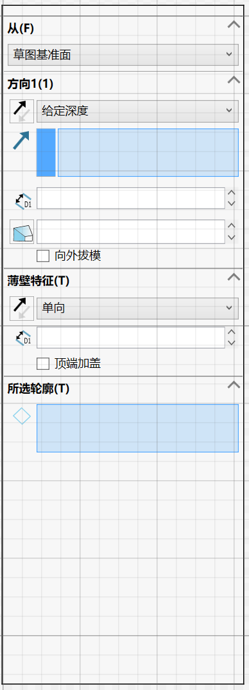
 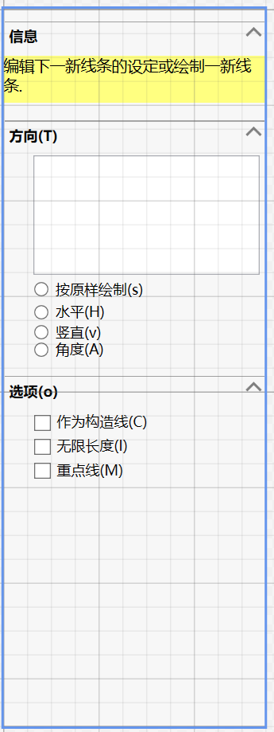
 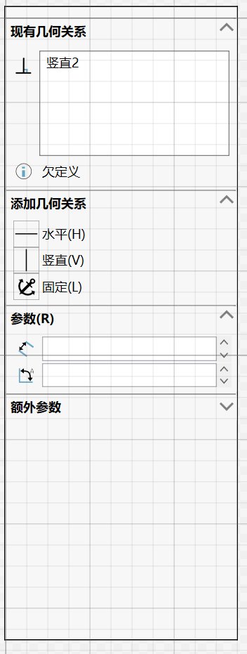
 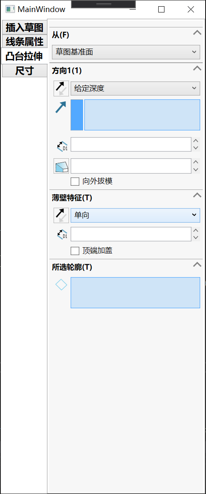
</div>

<div align=center>
     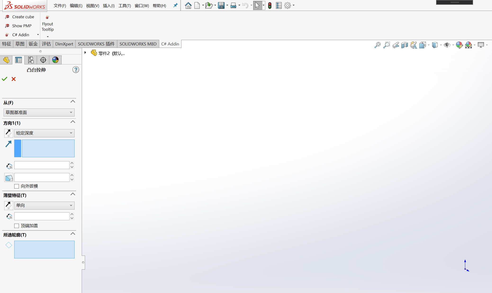
</div>


## 一.Summary

* A WPF Frameworks and Controls to develop SolidWorks PropertyManagerPage(PMPage) easily

* No PMPHandler.cs or other Handler code

* Redraw Some SolidWorks style *.svg icons(More icons is coming)

* SolidWorks style controls

## 二.Getting Started

1.Add a WPF usercontrol to your project.

2.Add the xaml namespace and resourcedictionary for your *.xaml

```xml
xmlns:page="clr-namespace:Du.PMPage.Wpf;assembly=Du.PMPage.Wpf"
```

```xml
<page:SldPMPage.Resources>
     <ResourceDictionary Source="pack://application:,,,/Du.PMPage.Wpf;component/Themes/Generic.xaml"/>
</page:SldPMPage.Resources>
```

3.Modeify the root(UserControl) as page:SldPMPage 

4.Modeify the *.xaml.cs code to inhert form SldPMPage

5.Add a new ctor for ISldWorks interface


```xml
<page:SldPMPage x:Class="PMPageWindow.Dimension"
             xmlns="http://schemas.microsoft.com/winfx/2006/xaml/presentation"
             xmlns:x="http://schemas.microsoft.com/winfx/2006/xaml"
             xmlns:mc="http://schemas.openxmlformats.org/markup-compatibility/2006" 
             xmlns:d="http://schemas.microsoft.com/expression/blend/2008" 
             xmlns:local="clr-namespace:PMPageWindow"
             xmlns:page="clr-namespace:Du.PMPage.Wpf;assembly=Du.PMPage.Wpf"
             mc:Ignorable="d" 
             d:DesignHeight="600" d:DesignWidth="400" PageTitle="sld">
    <page:SldPMPage.Resources>
        <ResourceDictionary Source="pack://application:,,,/Du.PMPage.Wpf;component/Themes/Generic.xaml"/>
    </page:SldPMPage.Resources>
    <StackPanel>
        <TabControl>
            <TabItem Header="模型">
                <StackPanel>
                    <ComboBox/>
                    <TextBox/>
                </StackPanel>
            </TabItem>
            <TabItem Header="gdsfg">
                <StackPanel>
                    <Expander Header="dsaf">
                        <TextBox>dsfsd</TextBox>
                    </Expander>
                    <Expander Header="dsaf">
                        <TextBox>dsfsd</TextBox>
                    </Expander>
                </StackPanel>
            </TabItem>
        </TabControl>
    </StackPanel>
</page:SldPMPage>

```

```csharp
    /// <summary>
    /// Dimension.xaml 的交互逻辑
    /// </summary>
    public partial class Dimension : SldPMPage
    {
        public Dimension()
        {
            InitializeComponent();
        }

        public Dimension(ISldWorks app):base(app)
        {
            //Don't forget
            InitializeComponent();
        }
    }

```

6.just use it

```csharp
PMPageWindow.PageSample sample = new PMPageWindow.PageSample(SwApp);
sample.ShowPage();
```

## 三.Icons and controls

### 1.Icons:

check the icons folder for *.svg file

<div>
 
 
 
 
 
 
 
 
 
 
 
 
 
 
 
</div>

### 2.Controls:

**LabelMsg：**

<div>
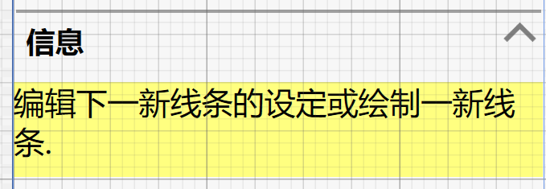
</div>

**Expander:**

<div>
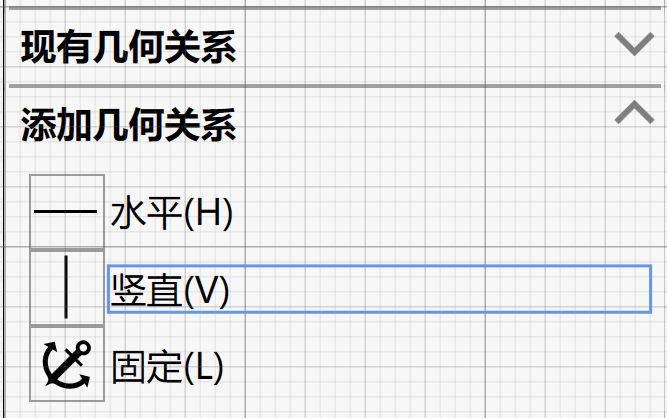
</div>

**IconButton:**

<div>
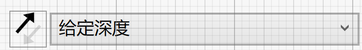
</div>

**NumberBox And IconLabel:**

<div>
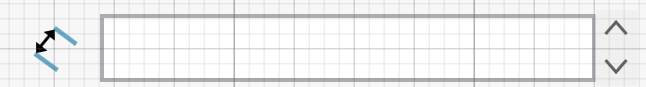
</div>

**SelectionBox**

<div>
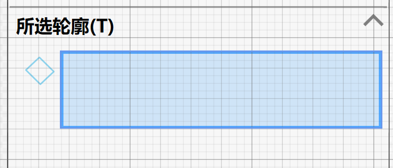
</div>

**ListBox**

<div>
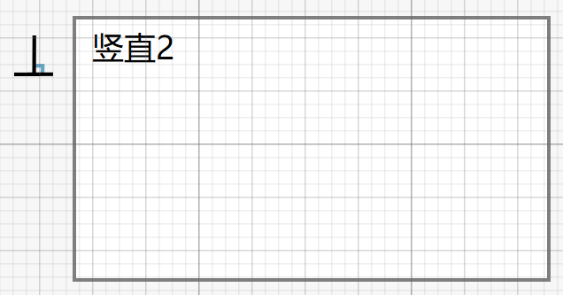
</div>

* CheckBox

<div>
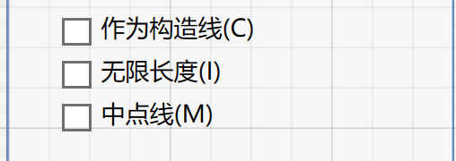
</div>

* RadioButton

<div>
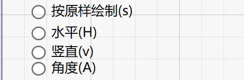
</div>

### 3.How to use the control

* LabelMsg

```xml
<page:SldLabelMsg Margin="-5,0">
     <TextBlock TextWrapping="Wrap">编辑下一新线条的设定或绘制一新线条.</TextBlock>
</page:SldLabelMsg>
```

* Expander:

```xml
<Expander IsExpanded="True" Margin="0,10,0,0">
     <Expander.Header>
          <TextBlock FontWeight="Black">选项(o)</TextBlock>
     </Expander.Header>
</Expander>
```

* IconButton:

```xml
<Button Style="{StaticResource ReverseDirectionIconButton}">
     <Image Source="{StaticResource ReverseDirectionDrawingImage}"></Image>
</Button>
<ComboBox Background="#FF8AD2ED" Grid.Column="1" SelectedIndex="0">
      <ComboBoxItem Content="给定深度"/>
</ComboBox>
```

* NumberBox And IconLabel:

```xml
<Label Style="{StaticResource DimensionIconLabel}"/>
<page:SldNumberBox Value="{Binding DoubleValue}" Grid.Column="1">
     <page:IOTextBox Height="23" Text="{Binding DoubleValue, StringFormat={}{0:0.00}}" />
</page:SldNumberBox>
```

* SelectionBox：

```xml
<page:SldSelectionBox page:SelectionBoxManager.Join="True" Height="50"  Grid.Column="1"/>
```

* CheckBox

```xml
<StackPanel Margin="20,0,0,0">
     <CheckBox Margin="0,2.5">作为构造线(C)</CheckBox>
     <CheckBox Margin="0,2.5">无限长度(I)</CheckBox>
     <CheckBox Margin="0,2.5">中点线(M)</CheckBox>
</StackPanel>
```

* RadioButton

```xml
<StackPanel Margin="20,0,0,0">
     <RadioButton Margin="0,5,0,2.5">按原样绘制(s)</RadioButton>
     <RadioButton Margin="0,2.5">水平(H)</RadioButton>
     <RadioButton>竖直(v)</RadioButton>
     RadioButton>角度(A)</RadioButton>
</StackPanel>
```

## 四.Next

* 1.SelectionBox'detail 
* 2.taskpane page
* 3.nuget published

## Contact me: 
email: 1831197727@qq.com
QQ群: 715259600