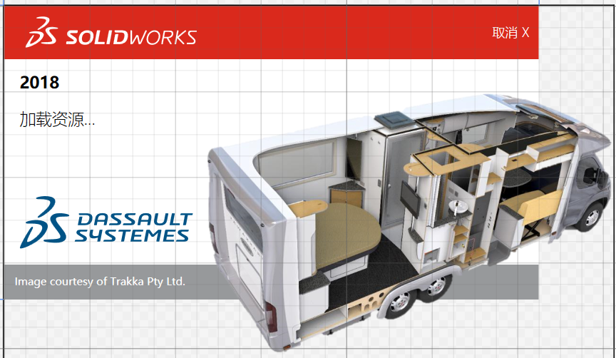
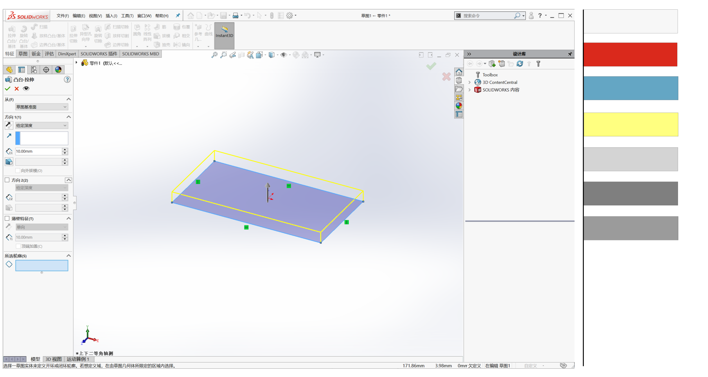
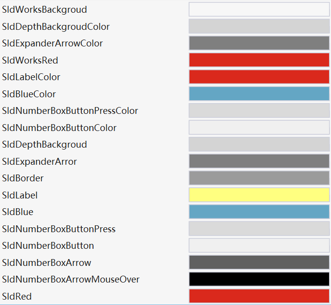

# 使用WPF设计SolidWorks风格UI

&emsp;&emsp; 作为一个SolidWorks插件开发人员，在界面设计时通常想让自己的设计像SolidWorks原生的风格一样，以便给用户更好的体验和更低的接受成本。

&emsp;&emsp;下文便以WPF为基础，分析了SolidWork风格UI的一些必要构成元素。并且用一些属性页的设计示例来探讨如何让设计出的SolidWorks风格的用户界面。

## 一.分析SolidWorks的用户界面

### 1.启动界面

<div align="center">
    
</div>

&emsp;&emsp;打开SolidWorks后，我们看到的就是这个SolidWorks启动界面。这个启动界面的风格就代表了SolidWorks UI的典型风格 红白灰，还有未在启动界面有所显示的蓝黄。这几种颜色造就了SolidWorks UI风格的基调。

### 2.主体界面

<div align="center">
    
</div>

&emsp;&emsp;以上显示的便是SolidWorks的主体界面，大概有上方的菜单栏，Ribbon选项卡；左侧的FeatureManager页面，右侧的Taskpane页面，下方的StatusBar和隐藏的ModelViewManager。在界面右侧我列出了SolidWorks主页面的主要出现的颜色。有使用面积最多的背景色，其16进制的RGB颜色为#F7F7F7,这是SolidWorks风格UI中使用最多的颜色。还有左上角SolidWorks Logo的红色和图标中使用比较多的蓝色，关于图标设计的内容在文章后面会有介绍。还有一些地方会用到的不同的灰色。

## 二.颜色，布局和字体

### 1.SolidWorks 颜色列表如下

<div align="center">
    
</div>

&emsp;&emsp;SolidWork中常用颜色如上，具体的rgb值如下，也可以查看github仓库的Themes/Color.xaml

```xml
    <Color x:Key="SldWorksBackgroud">#F7F7F7</Color>
    <Color x:Key="SldDepthBackgroudColor">#FFD4D4D4</Color>
    <Color x:Key="SldExpanderArrowColor">#FF7F7F7F</Color>
    <Color x:Key="SldWorksRed">#FFDA291C</Color>
    <Color x:Key="SldLabelColor">#FFDA291C</Color>
    <Color x:Key="SldBlueColor">#FF64A6C4</Color>
    <Color x:Key="SldNumberBoxButtonPressColor">#FFDADADA</Color>
    <Color x:Key="SldNumberBoxButtonColor">#FFF0F0F0</Color>
    <SolidColorBrush x:Key="SldDepthBackgroud" Color="#FFD4D4D4"></SolidColorBrush>
    <SolidColorBrush x:Key="SldExpanderArror" Color="#FF7F7F7F"></SolidColorBrush>
    <SolidColorBrush x:Key="SldBorder" Color="#FF9B9B9B"></SolidColorBrush>
    <SolidColorBrush x:Key="SldLabel">#FFFFFF80</SolidColorBrush>
    <SolidColorBrush x:Key="SldBlue">#FF64A6C4</SolidColorBrush>
    <SolidColorBrush x:Key="SldNumberBoxButtonPress">#FFDADADA</SolidColorBrush>
    <SolidColorBrush x:Key="SldNumberBoxButton">#FFF0F0F0</SolidColorBrush>
    <SolidColorBrush x:Key="SldNumberBoxArrow" Color="#FF606060"></SolidColorBrush>
    <SolidColorBrush x:Key="SldNumberBoxArrowMouseOver" Color="Black"></SolidColorBrush>
    <SolidColorBrush x:Key="SldRed" Color="{StaticResource SldWorksRed}"/>
```

### 2.布局

* Combox 的高度大概的21px 右侧边距大概为15
* IconButton 的高度大概的23px 邮册边距大概为15

其他控件高度和边距可以使用pixel ruler等工具测量

### 3.字体

SolidWorks默认使用了系统设置字体，在WPF中只需要设置FontFamily属性为系统字体即可。

```xml
<Setter Property = "FontFamily" Value= "{DynamicResource {x:Static SystemFonts.CaptionFontFamilyKey}}"/>
```

## 三.PMPage及其控件

&emsp;&emsp;SolidWorks 插件使用过程中使用最频繁的就是PMPage(ProperttManagePage),也叫做属性页，想要设计出SolidWorks风格的UI，PMPgae可以说是最重要的一部分。下面就以PMPage为例，来看一下如何用WPF设计PMPgae中的控件样式。

### 1.控件

<div align="center">
    <table>
         <tr>
            <td>Expander</td>
            <td>
                
            </td>
        </tr>
        <tr>
            <td>LabelMsg</td>
            <td>
                
            </td>
        </tr>
         <tr>
            <td>IconButton</td>
            <td>
                
            </td>
        </tr>
         <tr>
            <td>NumberBox And IconLabel:</td>
            <td>
                
            </td>
        </tr>
        <tr>
            <td>ListBox</td>
            <td>
               
            </td>
        </tr>
        <tr>
            <td>CheckBox</td>
            <td>
               
            </td>
        </tr>
        <tr>
            <td>RadioButton</td>
            <td>
               
            </td>
        </tr>
        <tr>
            <td>SelectionBox</td>
            <td>
               
            </td>
        </tr>
    </table>
</div>

### 2.控件样式

&emsp;&emsp;像CheckBox，RadioButton和ListBox和WPF中只有Border等样式有细微区别。而LabelMsg就的样式则变动较大，其背景变成了比较醒目的黄色。SelectionBox和IconButton的样式也需要重新设计。

#### 2.1 LabelMsg样式

&emsp;&emsp;此样式使用了#FFFFFF80作为背景色，这是一个16进制的rgba颜色，其rgba值为(255.255.255.128)。这里使用了一个label控件作为基类，并改变了其背景色字体大小等属性。

```xml
    <Style TargetType="local:SldLabelMsg">
        <Setter Property="Background" Value="#FFFFFF80"/>
        <Setter Property="FontSize" Value="13"/>
        <Setter Property="Template">
            <Setter.Value>
                <ControlTemplate TargetType="{x:Type Label}">
                    <Border Margin="0" BorderBrush="{TemplateBinding BorderBrush}" BorderThickness="{TemplateBinding BorderThickness}" Background="{TemplateBinding Background}" Padding="{TemplateBinding Padding}" SnapsToDevicePixels="True">
                        <ContentPresenter Margin="0,0,0,6" ContentTemplate="{TemplateBinding ContentTemplate}" Content="{TemplateBinding Content}" ContentStringFormat="{TemplateBinding ContentStringFormat}" HorizontalAlignment="{TemplateBinding HorizontalContentAlignment}" RecognizesAccessKey="True" SnapsToDevicePixels="{TemplateBinding SnapsToDevicePixels}" VerticalAlignment="{TemplateBinding VerticalContentAlignment}"/>
                    </Border>
                    <ControlTemplate.Triggers>
                        <Trigger Property="IsEnabled" Value="False">
                            <Setter Property="Foreground" Value="{DynamicResource {x:Static SystemColors.GrayTextBrushKey}}"/>
                        </Trigger>
                    </ControlTemplate.Triggers>
                </ControlTemplate>
            </Setter.Value>
        </Setter>
    </Style>
```

#### 2.2 SelectionBox样式

&emsp;&emsp;SelectionBox 作为SolidWorks中支持选择的控件，其功能强大和易于使用，一直是开发者选择使用PMPage开发页面的重要考虑因素。就SelectionBox的样式而讲，还是比较简单的，复杂的是其中的选择逻辑。SldSelectionBox控件只使用了一个触发器，在其被选中时，将背景色设置为#FFCFE4F7并且将边框设置未#FF53A9FF来达到SelectionBox的外观样式。

```xml
    <Style TargetType="{x:Type local:SldSelectionBox}">
        <Setter Property="Focusable" Value="True"/>
        <Setter Property="ContextMenu">
            <Setter.Value>
                <ContextMenu>
                    <MenuItem>消除选择</MenuItem>
                    <MenuItem>删除</MenuItem>
                </ContextMenu>
            </Setter.Value>
        </Setter>
        <Style.Triggers>
            <Trigger Property="IsActive" Value="True">
                <Setter Property="Background" Value="#FFCFE4F7"/>
                <Setter Property="BorderBrush" Value="#FF53A9FF"></Setter>
            </Trigger>
        </Style.Triggers>
    </Style>
```

<div align="center">
    <image src="resources/styles.png">
</div>

<a href="https://github.com/weianweigan/PMPageControl">
更多样式查看Github仓库
</a>

#### 2.3 组织样式

&emsp;&emsp;仓库中使用了WPF资源字典来组织了样式。使用时在*.xaml文件中引用命名空间加入资源字典即可。

* 命名空间:

```xml
xmlns:page="clr-namespace:Du.PMPage.Wpf;assembly=Du.PMPage.Wpf"
```

* 资源字典

```xml
<page:SldPMPage.Resources>
        <ResourceDictionary Source="pack://application:,,,/Du.PMPage.Wpf;component/Themes/Generic.xaml"/>
</page:SldPMPage.Resources>
```

### 3.PMPage

&emsp;&emsp; SolidWorks 允许在PMPage中嵌入Winform类型的控件，而Winform又与WPF具有良好的互操作性，这就给了我们在PMPage中嵌入WPF控件的可能性。本仓库中使用了一个继承自UserControl类型的SldPMPage控件来封装一个用于SolidWorks属性页的控件。使属性页和设计和WPF界面设计一样方便。具体实现可参加仓库中的src/Du.PMPage.Wpf/SldPMPage.cs.

#### 3.1.使用WPF用户控件设计属性页

&emsp;&emsp;通过WPF的依赖属性可以方便的设置PMPage的Title Height Pinned属性。

```xml
<page:SldPMPage x:Class="PMPageWindow.FeatureExtrusion"
             xmlns="http://schemas.microsoft.com/winfx/2006/xaml/presentation"
             xmlns:x="http://schemas.microsoft.com/winfx/2006/xaml"
             xmlns:mc="http://schemas.openxmlformats.org/markup-compatibility/2006" 
             xmlns:d="http://schemas.microsoft.com/expression/blend/2008" 
             xmlns:local="clr-namespace:PMPageWindow"
             xmlns:page="clr-namespace:Du.PMPage.Wpf;assembly=Du.PMPage.Wpf"
             mc:Ignorable="d" 
             d:DesignHeight="700" d:DesignWidth="250" PageTitle="凸台拉伸" PageHeight="700">
    <page:SldPMPage.Resources>
        <ResourceDictionary Source="pack://application:,,,/Du.PMPage.Wpf;component/Themes/Generic.xaml"/>
    </page:SldPMPage.Resources>
    <Grid>
    </Grid>
</page:SldPMPage>
```

#### 3.2.在SolidWorks中使用属性页

&emsp;&emsp;使用时只需要实例化并调用ShowPage方法即可。

```csharp
//控件
var page = new PMPageWindow.FeatureExtrusion(SwApp);
page.ShowPage();
```

#### 3.3 使用事件

&emsp;&emsp; 属性页事件使用一直是一件比较繁琐的事情，但在SldPMPage.cs中封装了Closed 和Closing 事件。使用也和WPF一样。更为重要的是完全使用WPF的属性页可以使用MVVM来开发。

```xml
<page:SldPMPage x:Class="PMPageWindow.FeatureExtrusion"
             xmlns="http://schemas.microsoft.com/winfx/2006/xaml/presentation"
             xmlns:x="http://schemas.microsoft.com/winfx/2006/xaml"
             xmlns:mc="http://schemas.openxmlformats.org/markup-compatibility/2006" 
             xmlns:d="http://schemas.microsoft.com/expression/blend/2008" 
             xmlns:local="clr-namespace:PMPageWindow"
             xmlns:page="clr-namespace:Du.PMPage.Wpf;assembly=Du.PMPage.Wpf"
             mc:Ignorable="d" 
             d:DesignHeight="700" d:DesignWidth="250" PageTitle="凸台拉伸" PageHeight="700" Closed="SldPMPage_Closed" Closing="SldPMPage_Closing">
    <page:SldPMPage.Resources>
        <ResourceDictionary Source="pack://application:,,,/Du.PMPage.Wpf;component/Themes/Generic.xaml"/>
    </page:SldPMPage.Resources>
    <Grid>
    </Grid>
</page:SldPMPage>
```

#### 3.4 ShowBubbleTooltipAt2

&emsp;&emsp;在*.xaml.cs 您可以通过ShowBubbleTooltipAt2来显示用户消息。

```csharp
ShowBubbleTooltipAt2("hi", "msg");
```

* 效果如下：

<div align="center">
    <image src="resources/demo.png">
</div>

&emsp;&emsp;同样的你还可以在Closing方法中使用此特性，并且检查参数，在参数不正确的情况下阻止用户关闭属性页。显示的效果和上面一样，但是阻止了用户关闭页面。

```csharp
private void SldPMPage_Closing(SolidWorks.Interop.swconst.swPropertyManagerPageCloseReasons_e reason, ClosingArg arg)
{
    arg.Cancel = true;
    arg.ErrorTitle = "hi";
    arg.ErrorMessage = "msg";
}
```

## 三.SolidWorks 风格图标

&emsp;&emsp;如果说上面我们用WPF设计了SolidWorks风格UI的骨骼，那么图标才是SolidWorks里面的灵魂。为了设计出和SolidWorks风格一致的界面，图标是必不可少的。下面有几个我用Inkscape绘制的SolidWorks本身的图标作为参考。具体到某个开发项目，还需要设计符合项目要求的图标。

<div align=“center”>
    <table>
        <tr>
            <td>尺寸</td>
            <td>
                 
            </td>
        </tr>
        <tr>
            <td>角度</td>
            <td>
                                 
            </td>
        </tr>
        <tr>
            <td>共线</td>
            <td>
                
            </td>
        </tr>
        <tr>
            <td>D1尺寸</td>
            <td>
                
            </td>
        </tr>
        <tr>
            <td>方向</td>
            <td>
                 
            </td>
        </tr>
        <tr>
            <td>拔模</td>
            <td>
                                
            </td>
        </tr>
        <tr>
            <td>相等</td>
            <td>
             
            </td>
        </tr>
         <tr>
            <td>轮廓</td>
            <td>
                 
            </td>
        </tr>
         <tr>
            <td>对称</td>
            <td>
                
            </td>
        </tr>
        <tr>
            <td>垂直</td>
            <td>
                
            </td>
        </tr>
        <tr>
            <td>几何关系</td>
            <td>
                
            </td>
        </tr>
        <tr>
            <td>固定</td>
            <td>
                 
            </td>
        </tr>
    </table>
</div>

&emsp;&emsp;使用矢量图绘制工具或者结合CAD，再参考上面的颜色卡，设计和SolidWorks风格相似的图标不是很困难。

* 共线的svg文件如下

```xml
<?xml version="1.0" encoding="UTF-8" standalone="no"?>
<!-- Created with Inkscape (http://www.inkscape.org/) -->

<svg
   xmlns:dc="http://purl.org/dc/elements/1.1/"
   xmlns:cc="http://creativecommons.org/ns#"
   xmlns:rdf="http://www.w3.org/1999/02/22-rdf-syntax-ns#"
   xmlns:svg="http://www.w3.org/2000/svg"
   xmlns="http://www.w3.org/2000/svg"
   xmlns:sodipodi="http://sodipodi.sourceforge.net/DTD/sodipodi-0.dtd"
   xmlns:inkscape="http://www.inkscape.org/namespaces/inkscape"
   width="50mm"
   height="50mm"
   viewBox="0 0 50 50"
   version="1.1"
   id="svg16"
   inkscape:version="0.92.3 (2405546, 2018-03-11)"
   sodipodi:docname="collinear.svg">
  <defs
     id="defs10" />
  <sodipodi:namedview
     id="base"
     pagecolor="#ffffff"
     bordercolor="#666666"
     borderopacity="1.0"
     inkscape:pageopacity="0.0"
     inkscape:pageshadow="2"
     inkscape:zoom="1.979899"
     inkscape:cx="31.722971"
     inkscape:cy="71.474232"
     inkscape:document-units="mm"
     inkscape:current-layer="svg16"
     showgrid="false"
     inkscape:window-width="1920"
     inkscape:window-height="1017"
     inkscape:window-x="1072"
     inkscape:window-y="826"
     inkscape:window-maximized="1" />
  <metadata
     id="metadata13">
    <rdf:RDF>
      <cc:Work
         rdf:about="">
        <dc:format>image/svg+xml</dc:format>
        <dc:type
           rdf:resource="http://purl.org/dc/dcmitype/StillImage" />
        <dc:title></dc:title>
      </cc:Work>
    </rdf:RDF>
  </metadata>
  <path
     style="fill:#000000;stroke:#000000;stroke-width:3px;stroke-linecap:butt;stroke-linejoin:miter;stroke-opacity:1"
     d="m 7,43 8,-8"
     id="path4547"
     inkscape:connector-curvature="0" />
  <path
     style="stroke:#64a6c4;stroke-width:3px;stroke-linecap:butt;stroke-linejoin:miter;stroke-opacity:1"
     d="m 15,35 5,-5"
     id="path4549"
     inkscape:connector-curvature="0" />
  <path
     d="m 22.5,27.5 5,-5"
     id="path4551"
     inkscape:connector-curvature="0"
     style="stroke:#64a6c4;stroke-width:3px;stroke-linecap:butt;stroke-linejoin:miter;stroke-opacity:1" />
  <path
     style="stroke:#64a6c4;stroke-width:3px;stroke-linecap:butt;stroke-linejoin:miter;stroke-opacity:1"
     d="m 35,15 -5,5"
     id="path4555"
     inkscape:connector-curvature="0" />
  <path
     style="fill:#000000;stroke:#000000;stroke-width:3px;stroke-linecap:butt;stroke-linejoin:miter;stroke-opacity:1"
     d="M 35,15 43,7"
     id="path4557"
     inkscape:connector-curvature="0" />
</svg>
```

## 四.设计界面

* 以下为使用WPF设计的界面，在PMPageWindow项目都里可以找到，希望给SolidWorks二次开发人员参考。

<div align="center">
    
</div>

<div align=center>
 
 
 
 
</div>

* 下面为WPF设计的属性页在SolidWorks中的显示效果

<div align="center">
     
</div>

## 五 关于项目PMPageControl

&emsp;&emsp;此仓库还在开发中，所以还有一些特性未开发完全。下面列出来的便是接下来需要支持的一些特性。

* [查看仓库](https://github.com/weianweigan/PMPageControl)

* 1.SelectionBox的选中响应逻辑。 
* 2.taskpane page的支持。
* 3.nuget 包的发布。
* 4.manipulator的支持。
